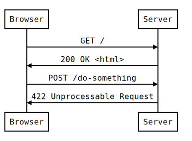

# Intro to HTTP Server Programming with Node

## Review

### HTTP Request-Response cycle



Project Code available at
https://github.com/daegren/lhl-w2d2-jul2-lecture

Today we will start our journey become full stack web
developers. What does _stack_ mean? All web apps are composed by a
minimum of **three stacks**, client, app/web, data. This week we are
going to focus on the client & app tier. We are going to create an app
that serves different HTML pages to manage a simple app that manages
provides shortURLs.

To implement this app we are going to use the **Express.js** library
for creating an HTTP server on top of Node.

## Agenda

- What is a Server?
- Node HTTP server basics using low level _http_ node module.
- Making life easier with **Express.js**
- Intro to _express_ middleware
- Intro to server side template engines - **EJS**
- Handle _POST_ request with Express and EJS

## Runnning the code

To install the code:

```shell
git clone https://github.com/daegren/lhl-w2d2-jul2-lecture
cd lhl-w2d2-jul2-lecture
npm install
```

To run the `http` sample

```shell
node simple-server.js
```

To run the express application

```shell
yarn simple-express.js
```

## What is a Server?

There are a few common patterns used for client/server communication. The one that is most common is called the Request-Response Model.

In the Request-Response Model a client sends a request to a server. The server then performs some computation and returns a response to the client.

Typically when we visualize servers we think of a rack of hardware with blinking lights and fans spinning. The reality is that without software those machines don't do much. Think of a server as an application on a machine that listens for a connection from a client.

There are a lot of different types of servers that you currently interact with. The performance of these servers is largely dependent on the hardware that they are running on.

- Database Server
- Game Server
- Mail Server
- Media Server
- Print Server
- Web Server

We can connect a machine to a network and run a server application on it, but there has to be a way for clients to find it. In 1981 the Internet Protocol (IP) specification was released. This document described the information necessary for finding a server as:

> A name indicates what we seek. An address indicates where it is. A route indicates how to get there.

In the case of a web server the name would be something like `http://www.lighthouselabs.ca`. The address would be `104.25.75.20`, and the route would be the machines/routers between you and the server.

### Ports

You can run multiple applications on a machine. If we were to run a mail server and a web server on the same machine how would we know which server to hand the request to? We use ports. If a server wants to run on a port between 1 and 1023 then you will need superuser access. Any user can run a server on ports 1024 to 65535.

The reserved ports for the Hypertext Transfer Protocol (HTTP) are **80** for un-secure communication, and **443** for secure communication.

### Applications

Apache, IIS (Microsoft) and nginx account for over 75% of the market share for all of the web servers on the internet.

When you you write an application that understands HTTP then you can configure one of these web servers to pass the requests that they receive to your application on a port you specify.

Today we will build an application using Node and we will run that application on port **9000**.

## Node HTTP functionality

Node allows use to create very simple HTTP servers. It can be used to
create sophisticated web apps, but we tend to use libraries that are
higher level due to maintainability. However all these libraries use Node's
_http_ module in the end.

We can create a HTTP server using the following code:

```javascript
var http = require('http')

var PORT = 8080;
var hostname = '127.0.0.1';

var server = http.createServer(function(req, res) {
    res.statusCode = 200;
    res.setHeader('Content-Type', 'text/html');
    res.end("Hello World");
}
server.listen(PORT, hostname, function() {
    console.log(`Server running on http://${hostname}:${PORT}/`);
});
```

We quickly learn that it became quite tedious managing this code.

## Express.js

The _express.js_ library makes our lives easier by handling the low
level _http_ module for us. It is also on of the most widely used node
libraries.

To get start let's install it on our project:

```javascript
yarn add express morgan body-parser ejs
```

_morgan, body-parser, ejs_ are libraries that extend the express
functionality that we will use later.

Express allows use to specify different actions use a better api. For
example we could specify the following action:

```javascript
app.get("/hello-world", function(req, res) {
  res.send("<h1>Hello World</h1>");
});
```

## Middleware

Express let's you use middleware to generalize behaviour for certain scenarios. If we want to serve static files (images, html, css, javascript) we can put them in a folder, and then tell Express that it should search there for any request and if it matches a path to a static file then return that. In this example we tell Express than any file in the `public/` directory can be served as static.

```javascript
app.use(express.static("public"));
```

With this configuration `public/images/lighthouse-labs.png` would be available at `http://localhost:9000/images/lighthouse-labs.png`.

Please see the `express-middleware.js` file for the expanded server that was
created during the lecture.

## EJS Templates

Embedded JS (EJS) is one of many templating libraries available for use in Express. EJS is a module so we need to install it with `npm install --save ejs`. In order to inform Express that we want to use EJS we set the value of `view engine` configuration to `ejs`.

```javascript
app.set("view engine", "ejs");
```

By default EJS template files are found in a `views/` directory. We can create a new `index.ejs` file and return it in a response with the `render()` method.

```javascript
app.get("/", function(request, response) {
  response.render("index");
});
```

A basic ejs file could contain only HTML if you wanted.

```HTML
<!DOCTYPE html>
<html>
  <head>
    <title>Index</title>
  </head>
  <body>
    <h1>Index</h1>
  </body>
</html>
```

EJS let's us embed JavaScript. We can use this to create dynamic pages. Let's say we wanted to display the User-Agent based on who makes the request. We need to send an object to the view engine that represents the variables we want to make available to our template. In this case we call it `agent`.

```javascript
app.get("/", function(request, response) {
  response.render("index", {
    agent: request.headers["user-agent"]
  });
});
```

We can then use that variable with the `<%= %>` syntax. The template system will read in the ejs file, find 'Embedded JavaScript' and evaluate it. When it is done the content is sent back to the client.

```HTML
<!DOCTYPE html>
<html>
  <head>
    <title>Index</title>
  </head>
  <body>
    <h1>Using <%= agent %></h1>
  </body>
</html>
```

In the case that you want to only evaluate JavaScript and not print out the return value to the template you can use the tag `<% %>`. This would be more commonly used for looping or conditionals.

```HTML
<!DOCTYPE html>
<html>
  <head>
    <title>Index</title>
  </head>
  <body>
    <ul>
    <% for(var i = 0; i < 10; i++) { %>
      <li><%= i %></li>
    <% } %>
    </ul>
  </body>
</html>
```

Please see the `express-middleware.js` file for examples.
